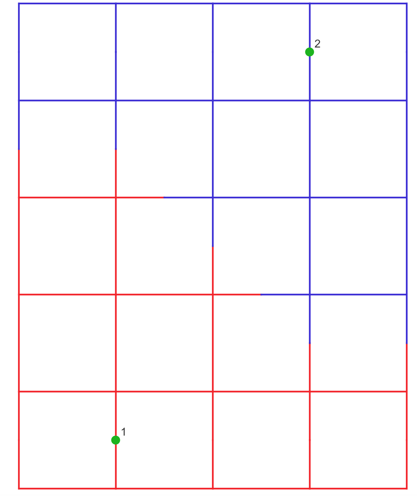
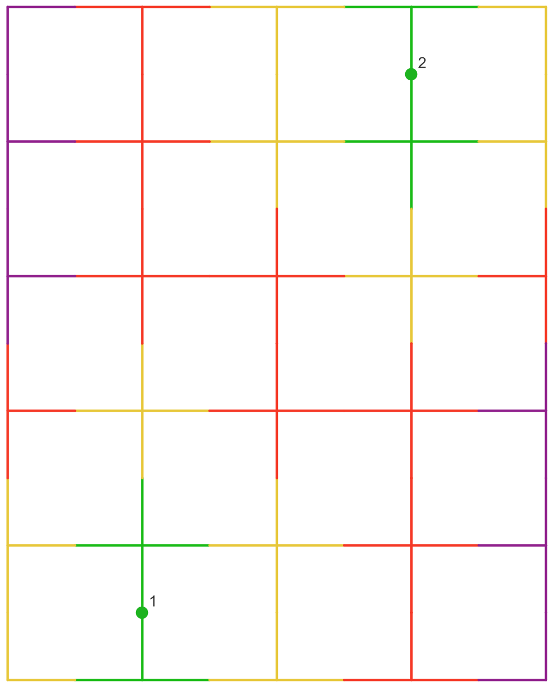
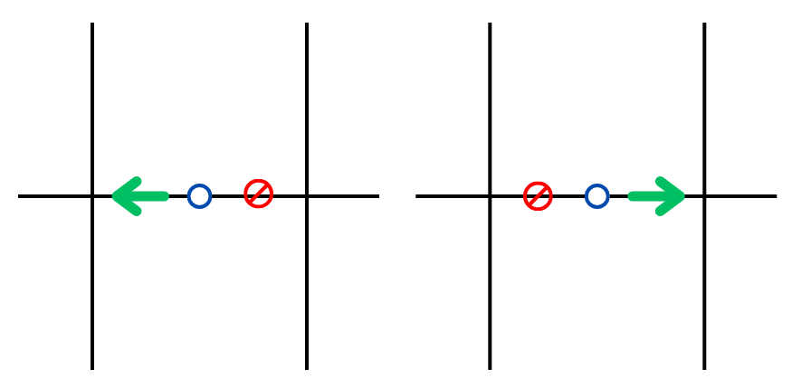
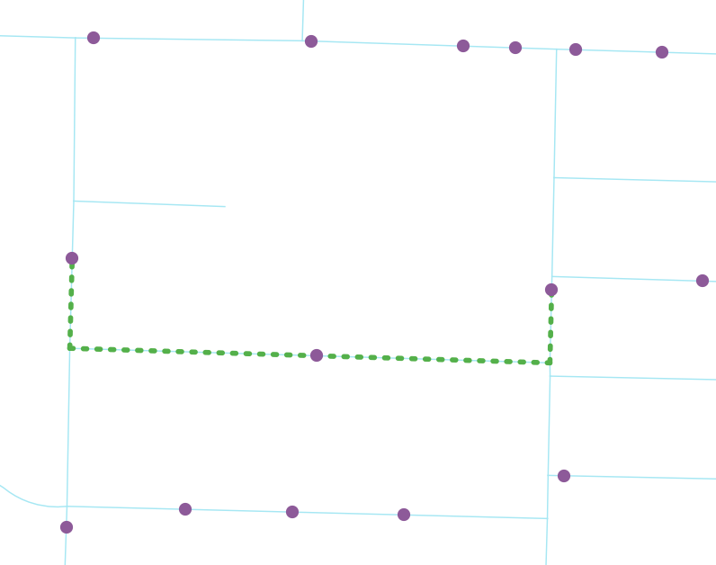
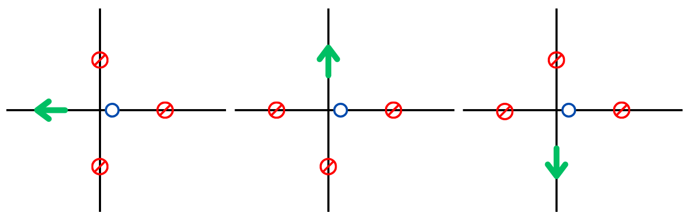
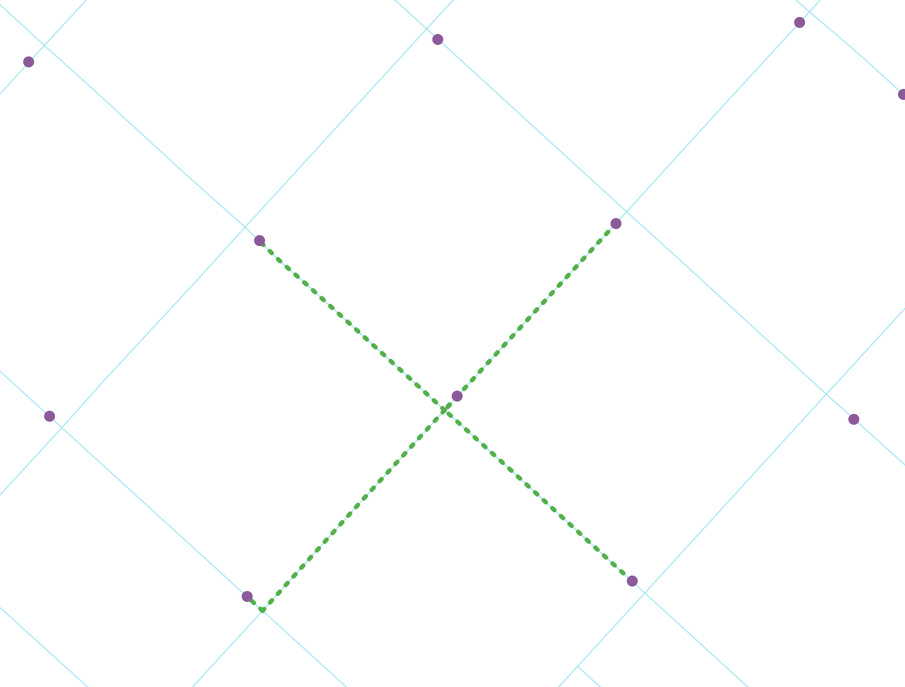
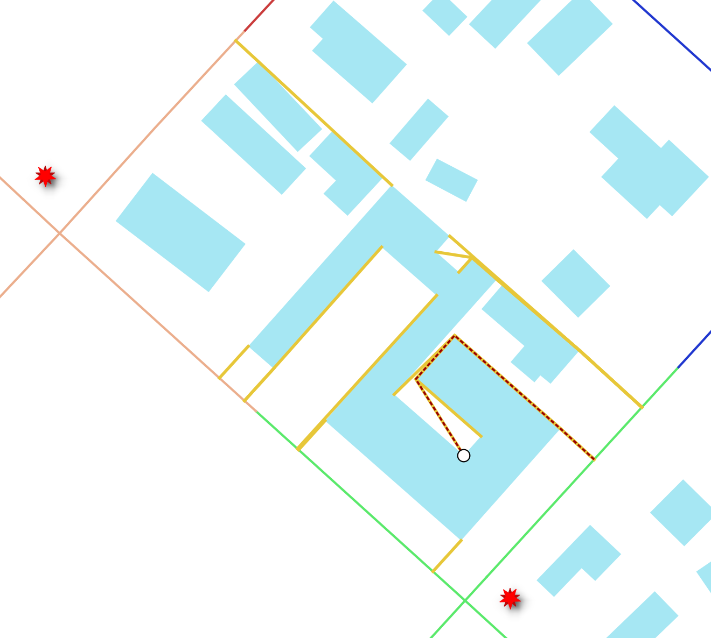

# AdjFind Source Code Documentation

This repository contains the source code for the AdjFind project, a C++ application that provides specialized transportation network algorithms.

• **Road Segmentation Mode**: Determines which service points (e.g., hydrants) are closest to each road segment using network distance, and optionally splits roads into discrete distance categories for service area analysis.

• **Neighboring Points Mode**: Identifies the nearest neighboring service points along a road network in each direction, calculating spacing distances between facilities like hydrants for regulatory compliance assessment.

• **Structure Access Mode**: Computes shortest unobstructed paths from building corners to road networks, finding the least accessible points on buildings for emergency response planning and fire code compliance.

## Quick Installation (macOS)

The easiest way to install AdjFind on macOS is using Homebrew:

```bash
# Add the repository as a tap
brew tap zwang-geog/AdjFind https://github.com/zwang-geog/AdjFind.git

# Install from the tap
brew install zwang-geog/adjfind/adjfind
```

Then run:
```bash
adjfind --help
```

## Supported Algorithms/Modes

### 1. Split road to service area or discrete distance brackets/categories (`--mode road-segmentation`)

Given a point dataset such as hydrant locations and a road network linestring dataset, we might be interested in knowing which hydrants a road linestring is closest to (for a road linestring between two intersections, what are the closest hydrants to it whereas the distance is measured using network distance?). Additional, a portion of a road linestring maybe closest to one hydrant, while the other portion of the same road linestring maybe closest to another hydrant. In such a case, road linestring needs to be segmentated or split at an equilibrium location where its network distances to either adjacent hydrant is the same. Effectively, the **service area of each point** over the road network will be delineated.

With mode parameter set to road-segmentation and without specifying distance-breakpoints parameter, the output effect of service areas is illustrated with the following figure: the portions of the network colored in red are closest to point 1 while the portions of the network colored in blue are closest to point 2. 



Alternatively, if distance-breakpoints parameter is specified, the road linestrings will be further split with the provided breakpoints, and each linestring in the output will be assigned with a **discrete distance bracket or category**. The output effect of distance categories (using distance-breakpoints 100,200,300) is illustrated with the following figure: the portion of the network within 100 units from a point is colored in green (distance_category 0-100), the portion of the network with distance_category 100-200 is colored in yellow, the portion of the network with distance_category 200-300 is colored in red, and the portion of the network with distance_category >=300 is colored in purple.



The output layer consists of following fields:
- `id` - unique identifier of each row
- `road_id` - the ID of the road linestring from the input data before any split operation; a raw linestring might be become multiple linestrings after split operation
- `point_id` - the ID of the point that is closest to the split road linestring
- `length` - the length of the output linestring (after splitting)
- `distance_category` - if distance-breakpoints parameter is specified, it will be a string like "0-100" or ">=300". Otherwise, it will be a string indicating the types of vertices that the edge connects to: "INTERSECTION-INTERSECTION", "INTERSECTION-SPLIT", "SPLIT-INTERSECTION", "SPLIT-SPLIT"
- `from-distance` - the shortest network distance between the first vertex of the linestring to the closest point
- `to-distance` - the shortest network distance between the last vertex of the linestring to the closest point

One example application of this mode will be assessing if any point on street or road frontage is not within the maximum distance standard to a hydrant. This mode is a good replacement of traditional buffering approach that only assumes Euclidean distance.

**Required Arguments:**
- `--road-file-path <path>` - Path to the road network file
- `--point-file-path <path>` - Path to the point file
- `--output-file <path>` - Output file path with extension

**Optional Arguments:**
- `--road-id-field <name>` - Field name for road ID (defaults to OGR FID)
- `--road-from-z-field <name>` - Field name for from z-level
- `--road-to-z-field <name>` - Field name for to z-level
- `--road-length-field <name>` - Field name for length (computed if not specified)
- `--road-layer-index <index>` - Layer index to read from road file; typically this parameter should not be set unless the input dataset is a geopackage with multiple layers (default: 0)
- `--point-id-field <name>` - Field name for point ID (defaults to ORG FID)
- `--point-layer-index <index>` - Layer index to read from point file; typically this parameter should not be set unless the input dataset is a geopackage with multiple layers (default: 0)
- `--reproject-to-epsg4326` - A flag variable that will reproject output to EPSG:4326 (WGS84)
- `--distance-breakpoints <values>` - Comma-separated positive numbers for distance breakpoints

**Example:**
```bash
./adjfind --road-file-path roads.gpkg --point-file-path points.gpkg --mode road-segmentation --output-file results.geojson --distance-breakpoints 100,200,300 --reproject-to-epsg4326
```

### 2. Paths to neighboring points (`--mode neighboring-points`)

Given a point dataset such as hydrant locations and a road network linestring dataset, we might be interested in knowing **which points are neighbors of a point** in the dataset, as well as the paths between them. In the context of road network, imagine a point feature such as hydrant that is located at the centerline of a road, and it is possible to go either left or right from this hydrant. **When going left, the first hydrant (excluding the origin hydrant) that it reaches will be one of the neighbors. Similarly when going right, the first hydrant that it reaches will be the other neighbor**.





The neighboring relationship in road network context may be referred as **spacings**, and some key ideas of spacings are described in [Figueroa et al. (2024)](https://onlinelibrary.wiley.com/doi/10.1111/tgis.13255).

If a point is located close to road intersection (controller by intersection-vertex-distance-threshold parameter whose default is 60), all outgoing directions from that intersection vertex will be checked for neighbors. In the below diagram, going left from the hydrant immediately reaches an intersection, so one neighbor will be identified going further left from the intersection, one neighbor will be identified going up from the intersection, and one neighbor will be identified going down from the intersection. The right-ward direction remains as usual.





The output has two datasets. The first is a linestring dataset that has exact name as specified in output-file parameter, and it has geometry of paths to neighbors (a.k.a. spacing paths) with each input point as starting point and after de-duplication (i.e., a pair of neighoring points will have only one path geometry written to the output). The following attributes are also available:
- `path_id` - unique identifier of each row
- `source_point_id` - the ID of the point (from input data) corresponding to the first vertex of the linestring (this point is considered as a neighbor of the target point, and target point is considered as a neighbor of this point)
- `target_point_id` - the ID of the point (from input data) corresponding to the last vertex of the linestring (this point is considered as a neighbor of the source point, and source point is considered as a neighbor of this point)
- `distance` - the network distance between the two neighboring points (i.e., spacing distance)

The second output dataset is a point dataset with "_snapped_points" appended to the end of the specified output file name. It has geometry of points after snapping to their closest road linestrings (other modes also have this snapping internally, but neighboring-points mode is the only mode that outputs the snapped point geometry). This point dataset provides summary statistics for each point (other aggregation levels such as by area or corridor might be more of interest for certain applications, and users of this C++ program can derive those statistics using the linestring dataset):
- `feature_id` - the ID of the point (from input data)
- `count` - the number of neighbors of the point
- `min` - the minimum spacing distance among all neighbors of this point
- `max` - the maximum spacing distance among all neighbors of this point
- `avg`- the average spacing distance among all neighbors of this point

One example application of this mode will be assessing conformity of hydrant spacing regulations.

**Required Arguments:**
- `--road-file-path <path>` - Path to the road network file
- `--point-file-path <path>` - Path to the point file
- `--output-file <path>` - Output file path with extension

**Optional Arguments:**
- `--road-id-field <name>` - Field name for road ID (defaults to OGR FID)
- `--road-from-z-field <name>` - Field name for from z-level
- `--road-to-z-field <name>` - Field name for to z-level
- `--road-length-field <name>` - Field name for length (computed if not specified)
- `--road-layer-index <index>` - Layer index to read from road file; typically this parameter should not be set unless the input dataset is a geopackage with multiple layers (default: 0)
- `--point-id-field <name>` - Field name for point ID (defaults to OGR FID)
- `--point-layer-index <index>` - Layer index to read from point file; typically this parameter should not be set unless the input dataset is a geopackage with multiple layers (default: 0)
- `--intersection-vertex-distance-threshold <value>` - Any point snapped to within this threshold from a road intersection will be subject to neighbor search from all outgoing directions from the intersection (default: 60.0)
- `--cutoff <value>` - If the path distance exceeds this cutoff and still no neighbor found along a given travel direction, the search along this direction will stop
- `--reproject-to-epsg4326` - A flag variable that will reproject output to EPSG:4326 (WGS84)

**Example:**
```bash
./adjfind --road-file-path roads.gpkg --point-file-path points.gpkg --mode neighboring-points --output-file neighboring_results.geojson
```

### 3. Building corners **to road** access distance and **to point** total distance + least-accessible-point of building exterior (`--mode structure-access`)

In applications such as firefighting of structure fires, we might be interested in knowning the minimum distance from any point on the building exterior to road network where fire trunk can access and park. Simply doing a snapping of building corner point to its Euclidean distance (straight-line) closest road linestring has two limitations: (1) the straight-line path may cross obstacles, such as other buildings, or even the building itself if the corner point is at the back of the building, so it might underestimate the access distance to the identified road linestring, (2) due to the presence of obstacles, the road linestring identified by Euclidean distance might not always lead to true shortest unobstructed path, and another road linestring might actually have a shorter unobstructed path.

Instead of doing simple Euclidean distance snapping of building corners to road network, this C++ program adopts a similar strategy as the [convex-path with spatial filtering algorithm](https://onlinelibrary.wiley.com/doi/10.1111/gean.12086) to compute shortest unobstructed paths (academic literature often refers this kind of problem as Euclidean shortest path problem). It should also be pointed out that traditional Euclidean shortes path problem assumes one origin point and one destination point, but this application tries to solve a one origin (e.g., building corner) to many destinations (infinite number of points that constitute the nearby snappable road linestrings); this C++ program also adopts a similar strategy as [Baik and Murray (2025)](https://www.sciencedirect.com/science/article/abs/pii/S0198971525000614).

Under default settings, **for each building (from the building dataset) and each building corner point (i.e., a polygon feature's outer ring vertices), a shortest unobstructed path to road network is computed**. The path distance is reported in the **access_distance** field of the output dataset. The end of the path geometry will be a point on the road linestring (access point). With this point and the corresponding road linestring identified, we are able to compute the network distance between this point and the nearest hydrant (thanks the method developed in road-segmentation mode); **the sum of this network distance and the access_distance is reported in the distance_to_assigned_point field** of the output dataset.

Least-accessible-point (a.k.a. furthest point) is **a point on the building exterior that has a shortest unobstructed path distance no less than the distance of any other point on the building exterior**. Starting from any point on a building's exterior, there are two possible directions to travel (characterized by different traversed corner points and road access points). If a point is least-accessible-point, the shortest unobstructed path distances for both directions should be approximately equal. In practice, sectional search is often used to identify the least-accessible-point, and a distance tolerance of 0.15 is assumed for sectional search. 

The structure-access mode also outputs the path to least-accessible-point in addition to building corners' paths. A separate point dataset is also generated; it is possible that a building has multiple least accessible points, but the algorithm can only identify and report one for each building. The path distance to least-accessible-point can be useful for determining if a structure meets the access standard specified in the fire code.

In the following figure, the shortest unobstructed paths to the building corner points are colored in yellow, and different hydrants (there are two in this example) can serve those building corner points. The least-accessible-point (white color with black stroke) and its corresponding path (dashed red) are also shown. The road access points (endpoints of the paths) of the building correspond to 3 different roads (top, left, and bottom). In case if the user determines that there is no access from one of those roads (for example, the top road) to the building, it is possible to manually specifying which road linestrings (e.g., the left and bottom road) the building can have unobstructued paths connect to, by editing a field in the input building dataset and setting the road-ids-snappable-field parameter of the C++ program accordingly. In fact, user should always check the result manually against other data sources such as satellite imagery, parcel dataset, and Google Street View to verify that the road that a given path connects to is truly accessible to the build.



The output has two datasets. The first is a linestring dataset that has exact name as specified in output-file parameter, and it has path geometry of both corner points and least-accessible-point. The path geometry does not include any road network component, and it ends at the road access point. It has following fields:
- `row_id` - unique identifier of each row
- `polygon_feature_id` - the path's corresponding building's ID from the input data. Each input polygon feature has multiple rows corresponding to different paths in the output
- `path_type` - One of "BUILDING_CORNER" or "LEAST_ACCESSIBLE_POINT" or "NOT_FOUND" (If no path found, access_distance, assigned_point_feature_id, distance_to_assigned_point, snapped_road_feature_id will be null)
- `assigned_point_feature_id` - the ID of the point in point dataset that is closest to the road access point of the path
- `snapped_road_feature_id` - the ID of the road linestring that the road access point is on (the road linestring that the shortest unobstructed path connects to)
- `distance_to_assigned_point` - the distance from building corner point or least-accessible-point to the point feature with assigned_point_feature_id, and it consists of both network distance and access distance
- `access-distance` - the distance from building corner point or least-accessible-point to the road access point; it is the length of the output path geometry

The second output dataset is a point dataset with "_least_accessible_point" appended to the end of the specified output file name. It has one row for each input polygon, and it has same fields as the linestring dataset excluding path_type field.

**WARNIHG: If a building overlaps with a road linestring, some of its corner points may not be able to find a path (the least-accessible point identified will thus be incorrect). If a building's corner point's closest point is on the portion of the road linestring that overlaps with another building, it may also not able to find a path. Road-building intersection should be avoided in the input data (building-building overlap is also recommended to be minimized if possible)**

**Required Arguments:**
- `--road-file-path <path>` - Path to the road network file
- `--point-file-path <path>` - Path to the point file
- `--building-file-path <path>` - Path to the building dataset file
- `--output-file <path>` - Output file path with extension

**Optional Arguments:**
- `--road-id-field <name>` - Field name for road ID (defaults to OGR FID)
- `--road-from-z-field <name>` - Field name for from z-level
- `--road-to-z-field <name>` - Field name for to z-level
- `--road-length-field <name>` - Field name for length (computed if not specified)
- `--road-layer-index <index>` - Layer index to read from road file; typically this parameter should not be set unless the input dataset is a geopackage with multiple layers (default: 0)
- `--point-id-field <name>` - Field name for point ID (defaults to OGR FID)
- `--point-layer-index <index>` - Layer index to read from point file; typically this parameter should not be set unless the input dataset is a geopackage with multiple layers (default: 0)
- `--building-id-field <name>` - Field name for building ID (defaults to OGR FID)
- `--building-layer-index <index>` - Layer index to read from building file; typically this parameter should not be set unless the input dataset is a geopackage with multiple layers (default: 0)
- `--is-obstacle-only-field <name>` - In case if a polygon feature in the dataset does not need to have paths being computed and it is only a potential obstacle for other polygon features, set the field value to true for this feature. Default is to compute paths for all polygons in the dataset (assume all features have field value false). This field is optional in building dataset
- `--road-ids-snappable-field <name>` - Optional field storing comma-separated road IDs in the building dataset. If this field exists and a feature has non-null field value, paths will only be possible to connect to those specified linestrings. If this field exists but a feature has null or empty field value, paths will be computed as usual with automatic candidate road linestring detection for the particular feature
- `--min-polygon-boundary-segment-length-for-nearest-road-edge-detection <length>` - This parameter is only used when computing least-accessible-point in rare occasion, and it will not be used if road-ids-snappable-field value is specified for a feature. It is relevant when a polygon boundary segment is long (default: 80.0) and have a portions of points potentially closest to road linestrings that are not closest for any corner point; a sectional search with this length will be performed on the boundary segment to identify potentially previously unincluded candidate road linestrings
- `--include-network-distance` - A flag variable that will include network distance in objective function of the path finding algorithm. Default (without explictly include this flag variable in command) is to find shortest unobstructed path from a point on building exterior to linestrings in road network (objective is to minimize the access_distance); this is ideal if we want to position fire trunks as close to building corners as possible to achieve sufficient water pressure. If this flag variable is included, objective is to minimize the distance_to_assigned_point (i.e., distance from a point on building exterior to hydrant, which includes both access distance and network distance); there is an additional constraint that forces the segment in unobstructed path linestring that connects to the road access point must be perpendicular to the road linestring
- `--reproject-to-epsg4326` - A flag variable that will reproject output to EPSG:4326 (WGS84)

**Example:**
```bash
./adjfind --road-file-path roads.gpkg --point-file-path points.gpkg --building-file-path buildings.gpkg --mode structure-access --output-file structure_results.geojson
```


## Input datasets recommendation

### Coordinate System

* The algorithms in this C++ program all assume cartesian coordinates, so the input geospatial datasets should have a projected coordinate system in meter or feet. Additionally, all the input datasets (road, point, and possibly building) should have the same projected coordinate system. 
* If the input datasets has a coordinate system in WGS84 (EPSG 4326), the program will try to reproject it to UTM coordinate internally. This reprojection may fail and is just a fallback strategy. It is recommended that the user determines an appropriate projected coordinate system first and performs reprojection before running this program.
* The output coordinate system will be the same as input (or in UTM if internal reprojection is performed) by default, unless reproject-to-epsg4326 parameter is specified.

### Road Network

* At the location where road intersection exists, the corresponding linestrings must be split/planarize at that location. Graph that is used for path finding will create vertices at linestrings' endpoints, and identify common vertex between two linestrings with a distance tolerance of 0.01.

### Point Dataset

* Points do not need to be at network intersection nor on the road linestring. A Euclidean-distance based snapping will be performed to snap points to their nearest road edges. However, it is still recommended to make sure the point is closest to the desired road linestring manually by user.

## Building and Installation (for developers)

### Prerequisites

Before building this project, ensure you have the following dependencies installed:

- **CMake** (version 4.0.1)
- **C++ Compiler** with C++17 support (Clang 16.0.0)
- **GDAL** (version 3.10.2) - for data IO
- **Boost** (version 1.82.0) - for boost geometry library
- **nlohmann_json** (version 3.12.0) - for parameter parsing (WASM builds only)

### Installing Dependencies

**Note on Linking Strategy:**
- **GDAL**: Dynamically linked - must be installed on the target system
- **Boost**: Mixed approach - geometry (header-only), system/filesystem (compiled but statically linked) - no runtime installation needed  
- **nlohmann_json**: Header-only library - included in the binary (WASM builds only)
- **Standard libraries**: Partially statically linked for better compatibility

#### On Ubuntu/Debian:
```bash
sudo apt update
sudo apt install cmake build-essential libgdal-dev libboost-all-dev
```

#### On macOS (using Homebrew):
```bash
brew install cmake gdal boost
```

#### On Windows:
- Install [Visual Studio 2022 Community](https://visualstudio.microsoft.com/downloads/) (free)
- Install [CMake](https://cmake.org/download/)
- Install dependencies via vcpkg:
  ```bash
  winget install Microsoft.vcpkg
  vcpkg install gdal:x64-windows boost:x64-windows
  ```

### Building the Project

1. **Create a build directory:**
```bash
mkdir build
cd build
```

2. **Configure with CMake:**
```bash
cmake ..
```

3. **Build the project:**
```bash
make -j$(nproc)  # On Linux/macOS
# or
cmake --build . --config Release  # On Windows
```

4. **Install (optional):**
```bash
sudo make install
```

### Runtime Dependencies (for users)

**GDAL must be available on the target system (If user has QGIS or geopandas installed, likely no further action is needed):**

#### Linux:
```bash
# Ubuntu/Debian (newest versions - recommended)
sudo apt update
sudo apt install libgdal-dev

# CentOS/RHEL
sudo yum install gdal

# Note: Boost is header-only, no runtime installation needed
```

#### macOS:
```bash
# Install newest versions (recommended)
brew update
brew install gdal boost

# Or install specific versions if needed
# brew install gdal@3.4 boost@1.82
```

#### Windows:
- GDAL is included with the vcpkg installation
- Ensure the vcpkg environment is properly configured

## Disclaimer

**IMPORTANT: PLEASE READ THIS DISCLAIMER CAREFULLY BEFORE USING THIS SOFTWARE**

The authors and contributors of this repository are not liable for any damages, losses, or injuries resulting from using the program or the program's derivative works. The authors and contributors of this repository also are not liable for any damages, losses, or injuries resulting from any failure of the program, including but not limited to:

- Inability to run or execute the program
- Program crashes, hangs, or freezes without producing output
- Production of erroneous, incomplete, or incorrect results
- Data corruption or loss
- System instability or performance degradation
- Any indirect, incidental, special, consequential, or punitive damages

**User Responsibilities:**

Users have the sole responsibility for:
- Determining if the program is suitable for their specific use cases
- Ensuring input data quality, accuracy, and compatibility
- Setting program parameters appropriately for their applications
- Validating and verifying output results meet their expectations
- Understanding the limitations and assumptions of the algorithms

**No Warranty:**

This software is provided "AS IS" without warranty of any kind, either express or implied, including but not limited to:
- Warranties of merchantability
- Warranties of fitness for a particular purpose
- Warranties of non-infringement
- Warranties that the software will meet your requirements
- Warranties that the software will be error-free or uninterrupted

**Limitation of Liability:**

In no event shall the authors, contributors, or copyright holders be liable for any claim, damages, or other liability, whether in an action of contract, tort, or otherwise, arising from, out of, or in connection with the software or the use or other dealings in the software.

By using this software, you acknowledge that you have read this disclaimer, understand it, and agree to be bound by its terms.

## License

This project is licensed under the **MIT License** - see below for details:

```
MIT License

Copyright (c) 2025 Zifan Wang

Permission is hereby granted, free of charge, to any person obtaining a copy
of this software and associated documentation files (the "Software"), to deal
in the Software without restriction, including without limitation the rights
to use, copy, modify, merge, publish, distribute, sublicense, and/or sell
copies of the Software, and to permit persons to whom the Software is
furnished to do so, subject to the following conditions:

The above copyright notice and this permission notice shall be included in all
copies or substantial portions of the Software.

THE SOFTWARE IS PROVIDED "AS IS", WITHOUT WARRANTY OF ANY KIND, EXPRESS OR
IMPLIED, INCLUDING BUT NOT LIMITED TO THE WARRANTIES OF MERCHANTABILITY,
FITNESS FOR A PARTICULAR PURPOSE AND NONINFRINGEMENT. IN NO EVENT SHALL THE
AUTHORS OR COPYRIGHT HOLDERS BE LIABLE FOR ANY CLAIM, DAMAGES OR OTHER
LIABILITY, WHETHER IN AN ACTION OF CONTRACT, TORT OR OTHERWISE, ARISING FROM,
OUT OF OR IN CONNECTION WITH THE SOFTWARE OR THE USE OR OTHER DEALINGS IN THE
SOFTWARE.
```


